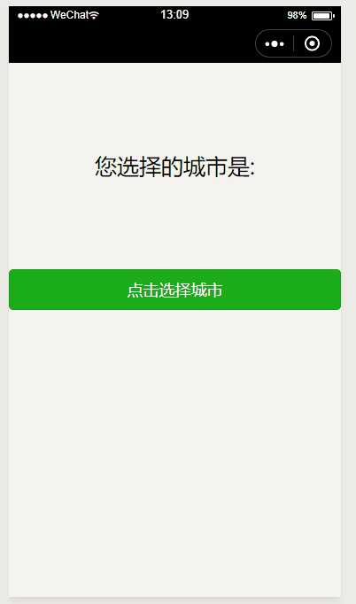

> 插件名称：城市选择组件，在申请插件页面搜索即可，无需确认，即添即用。

# 预览



# 属性

|    属性     |   类型   | 默认值 | 说明                     |
| :--------- | :------ | :----: | :----------------------- |
| haveHistory | Boolean  |  true  | 是否需要显示历史选择一栏 |
| bindconfirm | Function |  none  | 点击“完成”后的回调       |

# 回调参数

|       属性       |  类型  | 说明       |
| :-------------- | :---- | :--------- |
|       code       | Number | 地区编码   |
|    firstChar     | String | 拼音首字母 |
|       name       | String | 城市名称   |
|       rank       | Number | ----       |
| subLevelModeList |  null  | null       |

# 示例

```html
<city-choose haveHistory="{{false}}" catch:confirm="confirm" />
```

```javascript
Page({
    confirm({ detail }) {
        console.log(detail);
        /*
        {
            code: 101280600,
            firstChar: "s",
            name: "深圳",
            rank: 0,
            subLevelModelList: null
        }
        */
    }
});
```
